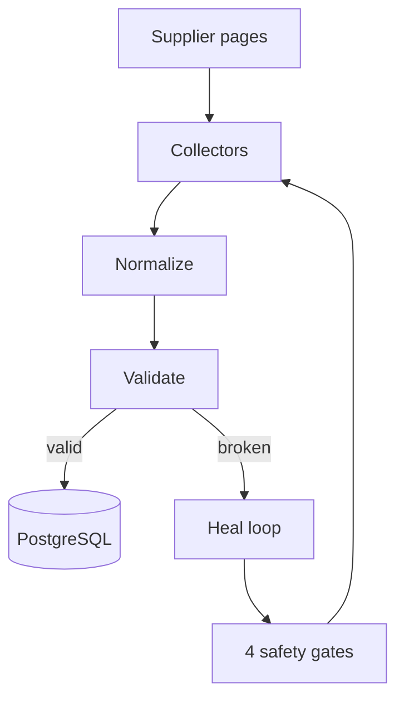

### I build products that sit somewhere between **useful**, **technical**, and **slightly over-engineered**.

[**Portfolio**](https://aniruddhadev.in/) · [**LinkedIn**](https://linkedin.com/in/aniruddha2704) · [**LeetCode**](https://leetcode.com/aniruddha-chaudhari)

 

<table>
<tr>
<td width="33%" valign="top">

### ⚡ Product Engineering

Web and mobile products with real users, real state and the boring-but-important infrastructure around them.

**React · Next.js · React Native · Node.js**

</td>
<td width="33%" valign="top">

### 🧠 AI Systems

Agents, memory, RAG, structured data pipelines and AI features that do more than wrap a chat endpoint.

**Gemini · AI SDK · Vector Search · Agents**

</td>
<td width="33%" valign="top">

### 🧪 Experiments

Games, real-time systems, browser APIs, scraping, automation and whatever rabbit hole looks interesting next.

**Phaser · WebSockets · Docker · PostgreSQL**

</td>
</tr>
</table>

# 🚀 Featured work

## 01 — VantageZero

> **Hardware buildability intelligence:** how many units can we actually build today, and which component stops us?

<table>
<tr>
<td width="58%" valign="top">

Vantage watches public distributor and manufacturer pages for **stock, incoming quantity, lead time, price breaks and lifecycle status**.

The interesting part is not scraping the page — it is deciding whether the data can be trusted when the page changes.

- **5 custom collectors** across **3 regions**
- source-specific normalization into one canonical schema
- Zod validation before observations are written
- self-healing collectors with **identity, shape, continuity and collision gates**
- scheduled collection through GitHub Actions
- buildability, bottleneck and cross-supplier pricing views

**Stack**  
`Next.js` `TypeScript` `PostgreSQL` `Bright Data` `Zod`

[**Live app ↗**](https://vantagezero.vercel.app) · [**Repository ↗**](https://github.com/aniruddha-chaudhari/vantagezero)

</td>
<td width="42%" valign="top">

### Data flow

</td>
</tr>
</table>

---

<table>
<tr>
<td width="50%" valign="top">

## 02 — 🌌 Nebulax

### Pixel arcade universe

A retro browser arcade built around a strong visual identity rather than a generic game menu.

Includes multiple playable experiences:

- **BattleDeck**
- **Quizzy**
- **Skatepark Dash**
- **WodBlitz**

The UI mixes pixel-art styling, space imagery, parallax motion and interactive transitions.

**Stack**  
`Next.js` `React` `Phaser` `Framer Motion` `Tailwind CSS`

[**Repository ↗**](https://github.com/aniruddha-chaudhari/nebulax)

</td>
<td width="50%" valign="top">

## 03 — ✦ Gem AI

### Conversational AI with memory

A Gemini-powered chat application built as a complete product rather than a stateless demo.

- Google authentication
- persisted chat history
- streaming AI responses
- **per-user long-term memory**
- memory inspection and deletion
- responsive dark UI

**Stack**  
`Next.js` `React` `TypeScript` `Gemini` `Neon` `Prisma` `Supermemory`

[**Live app ↗**](https://gemai.aniruddhadev.in) · [**Repository ↗**](https://github.com/aniruddha-chaudhari/gemai)

</td>
</tr>
</table>

# 🧰 Toolbox

 

| Area | Things I reach for |
|---|---|
| **Frontend** | TypeScript, React, Next.js, React Native, Tailwind CSS |
| **Backend** | Node.js, Express, Python, REST APIs, real-time systems |
| **Data** | PostgreSQL, MongoDB, Supabase, Neon, vector databases |
| **AI** | Gemini, Vercel AI SDK, agents, RAG, embeddings, memory |
| **Infra / tools** | Docker, GitHub Actions, Git, Cloudflare, scraping pipelines |

# 📈 GitHub activity

# 🌐 Find me elsewhere

[**aniruddhadev.in**](https://aniruddhadev.in/) · [**LinkedIn**](https://linkedin.com/in/aniruddha2704) · [**LeetCode**](https://leetcode.com/aniruddha-chaudhari) · [**Kaggle**](https://kaggle.com/aniruddhachaudhari27)

 

